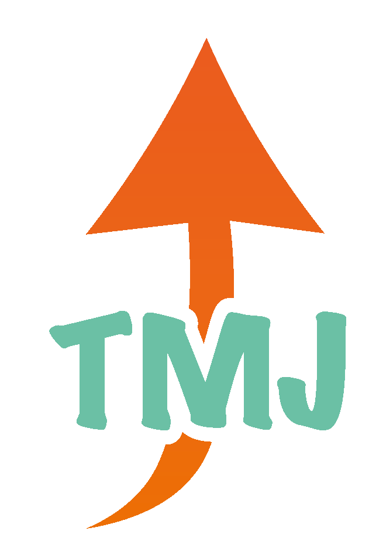

<h1 align="center">
    
</h1>

📱 📚 A TMJ (Trabalho, Mercado, e Jovens) é uma aplicação que tem uma interface
amigável para um ambiente de gamificação, buscando conectar jovens entre 14 e 24 anos a oportunidades de trabalho, principalmente do modelo Jovem Aprendiz.
Em nossa plataforma, o jovem terá oportunidade de interagir com conteúdos para capacitação de Soft e Hard Skills, acumulando pontuação conforme avança nos cursos.
Essa pontuação será usada para que as empresas parceiras em busca de jovens aprendizes encontrem usuários qualificados e que tenham Fit com a empresa.

Acesse o site aqui:

### `Ferramentas`

A parte front-end do projeto foi construída em React com componentes funcionais, e Local Storage para armazenamento de dados.

### `Instalação do Projeto:`

```
npm install
npm install --save react-router-dom
npm install react-player
```
### `Iniciar o Servidor:`

```
npm start
```

### `P.S.:`
Esse projeto foi desenvolvido para dispositivos mobile. Para uma melhor visualização, rode com telas de 377 x 820.

### `Time 106:`
Bruna Franciele - Desenvolvedora
Júlia Pôrto - Desenvolvedora
Luiza Yassuda - UX / Designer
Felipe Spina - Business

### `HACKATHON CCR - NOVOS CAMINHOS PARA A JUVENTUDE`

